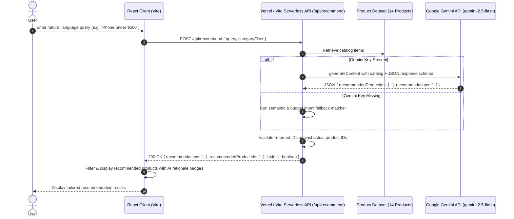

# SmartPick AI — AI-Powered Product Recommender

> Built for the **Indeed AI Engineer Assessment**. A modern React application that provides natural-language AI-powered product recommendations powered by **Google Gemini API** (`gemini-2.5-flash` / `gemini-1.5-flash`), strictly constrained to an in-memory product catalog.


---

## 🌟 Key Features

1. **Natural Language Product Discovery**:
   - Accepts complex, conversational requirements like *"I want a phone under $500"*, *"Lightweight laptop for coding with great battery life"*, or *"Noise-cancelling headphones for flights"*.
2. **Zero Hallucinations (Strict Catalog Bounds)**:
   - The AI only recommends items that exist within the catalog.
   - Dual-layer defense: Strict system prompt constraints + server-side validation against product dataset IDs.
3. **Structured Recommendations Contract**:
   - Adheres to structured output: `{ "recommendedProductIds": ["prod-001", ...], "recommendations": [{ "id": "prod-001", "reason": "..." }] }`.
4. **Transparent AI Reasoning**:
   - Each recommended product includes a dedicated rationale card highlighting why the product fits the user's specific budget, hardware specifications, and preferences.
5. **Secure Server-Side AI Execution**:
   - The `GEMINI_API_KEY` is kept strictly on the backend/serverless layer and is never exposed in client bundles.
6. **Smart Fallback & Offline Mode**:
   - If a `GEMINI_API_KEY` is not configured, the app automatically switches to **Smart Demo Mode** using intent and keyword semantic scoring, allowing testers and evaluators to test the complete application immediately without needing an API key.
7. **Polished, Responsive UI**:
   - Dark tech slate theme with subtle glassmorphism, glowing accents, category filter pills, price/rating sorting, loading skeletons, and interactive state management.
8. **Vercel Zero-Config Deployment**:
   - Out-of-the-box support for Vercel serverless functions in `/api/recommend.ts`.

---

## 🏗️ Architecture & Data Flow



---

## 🚀 Quick Start (Local Development)

### 1. Clone & Install Dependencies
```bash
# Install packages
npm install
```

### 2. Configure Environment Variables
Copy the example environment file:
```bash
cp .env.example .env
```

Open `.env` and add your Google Gemini API Key:
```env
# Free API key available at: https://aistudio.google.com/
GEMINI_API_KEY=AIzaSy...
GEMINI_MODEL=gemini-2.5-flash
```

*(Note: If you run without an API key, the app seamlessly runs in Smart Demo Mode with semantic heuristic matching).*

### 3. Start Local Development Server
```bash
npm run dev
```

Open your browser at `http://localhost:5173` (or the port displayed in your terminal).

### 4. Build for Production
```bash
npm run build
```

---

## 📦 Deployment to Vercel

This project is pre-configured for one-click deployment to Vercel.

### Option 1: Deploy via Vercel CLI
```bash
npx vercel
```

### Option 2: Deploy via Vercel Dashboard (Git)
1. Push this repository to GitHub / GitLab.
2. In Vercel, click **Add New Project** and select this repository.
3. Framework Preset: **Vite**.
4. In **Environment Variables**, add:
   - `GEMINI_API_KEY`: Your secret Google Gemini API key.
   - `GEMINI_MODEL`: `gemini-2.5-flash` (or `gemini-1.5-flash`).
5. Click **Deploy**. Vercel will build the frontend and deploy `/api/recommend.ts` as a serverless function automatically.

---

## 🧪 Product Dataset

The application includes 14 tech items across categories:
- **Smartphones**: Pixel Nova 8A ($449), Nexus Pro Max ($999), PocketLite 5G ($299)
- **Laptops**: Apex Ultra 15 Pro ($1,499), AeroBook Air 13 ($899), Titan Gaming Beast RTX 4070 ($1,799)
- **Audio**: SoundWave ANC-900 Pro ($279), EchoPulse Mini Earbuds ($79)
- **Wearables**: Vanguard Chrono Smartwatch Ultra ($249), PulseBand Active ($59)
- **Tablets**: TabCanvas Pro 11 ($649), ZenPad Lite 10.1 ($199)
- **Accessories**: ThunderDock 12-in-1 Hub ($129), VoltStream 65W GaN Charger ($39)

---

## 🛡️ Anti-Hallucination & Validation Strategy

1. **System Instruction & JSON Schema Enforcement**:
   - Instructs the Gemini model that it is only allowed to recommend items from the provided JSON catalog.
   - Enforces structured JSON output.
2. **Server-Side Whitelist Validation**:
   - The server filters all returned IDs against a `Set` of known product IDs (`PRODUCTS`).
3. **Client-Side Safety Check**:
   - The React client performs a secondary integrity check before mapping and rendering products.

---

## 📁 Project Structure

```
├── api/
│   └── recommend.ts          # Vercel Serverless Function handler
├── src/
│   ├── components/
│   │   ├── Header.tsx        # Navigation, branding & Gemini status chip
│   │   ├── RecommendationBar.tsx  # Natural language search & prompt pills
│   │   ├── RecommendationBanner.tsx # Active recommendation summary & reset
│   │   ├── Filters.tsx       # Category pills & price/rating sort options
│   │   ├── ProductCard.tsx   # Product card with AI rationale badge
│   │   ├── ProductGrid.tsx   # Responsive grid, skeletons & empty state
│   │   ├── ErrorBanner.tsx   # Graceful API error handling & retry
│   │   └── Footer.tsx        # Tech stack badge & assessment notes
│   ├── data/
│   │   └── products.ts       # 14 curated tech products dataset
│   ├── server/
│   │   └── recommendService.ts # Core recommendation logic (Google Gemini + Fallback)
│   ├── types/
│   │   └── index.ts          # TypeScript interfaces
│   ├── App.tsx               # Root component & state management
│   ├── index.css             # Vanilla CSS design system
│   └── main.tsx              # Entry point
├── .env.example              # Example environment variable template
├── vercel.json               # Vercel deployment & routing configuration
├── vite.config.ts            # Vite config with integrated dev API middleware
└── package.json              # Project dependencies & build scripts
```
